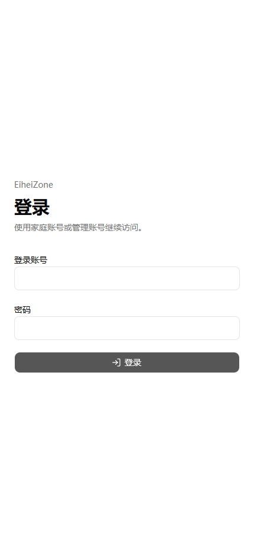

# EiheiZone

English | [简体中文](README.zh-CN.md) | [日本語](README.ja.md)

EiheiZone is a private family information portal for sharing life updates, answering family questions, and recording significant expenses. It combines a public-facing feed with role-protected family and owner workspaces in one responsive web application.

**V1 status:** released and accepted on August 5, 2026 for small-scale family use.

**Production site:** [https://eihei.zone](https://eihei.zone)

<p align="center">
  
</p>

> The V1 user interface is in Simplified Chinese. The English, Chinese, and Japanese options above are README translations, not application localization.

## Features

- **Role-based access:** separate Public, Family, and Owner experiences, enforced by the backend.
- **Posts:** Owner-managed life updates with `public` or `family` visibility.
- **Family Q&A:** Family and Owner users can ask questions; the Owner can answer them.
- **Significant expenses:** private family records with exact decimal amounts and ISO 4217 currency codes.
- **Dashboard:** recent Posts, Q&A, and expenses aggregated without a separate dashboard table.
- **Installable experience:** responsive web UI, PWA manifest, and production HTTPS deployment.
- **Operational tooling:** Alembic migrations, account maintenance scripts, health checks, and automated tests.

## Roles and permissions

| Capability | Public | Family | Owner |
| --- | :---: | :---: | :---: |
| View public Posts | Yes | Yes | Yes |
| View family-only Posts | No | Yes | Yes |
| Ask and view family questions | No | Yes | Yes |
| View significant expenses | No | Yes | Yes |
| View the family Dashboard | No | Yes | Yes |
| Manage Posts and expenses | No | No | Yes |
| Answer questions and use Owner Workspace | No | No | Yes |

V1 has no public registration or user-management page. Trusted operators create accounts and reset passwords with backend scripts.

## Architecture

```text
Browser / PWA
    |
    v
Caddy (HTTPS and reverse proxy)
    |-- page requests --> Next.js 16 / React 19
    `-- /api/* --------> FastAPI
                              |
                              v
                         PostgreSQL
```

The browser uses one site origin. Next.js handles pages and interaction, while FastAPI owns authentication, authorization, business rules, transactions, and all database access. Backend modules follow `Router -> Service -> Repository -> PostgreSQL`.

| Area | Technology |
| --- | --- |
| Frontend | Next.js 16, React 19, TypeScript, Tailwind CSS 4, shadcn/ui |
| Backend | Python 3.14, FastAPI, Pydantic 2, SQLAlchemy 2 |
| Data | PostgreSQL, Alembic, UUID keys, UTC timestamps, exact decimal amounts |
| Security | Argon2id, server-side database sessions, HttpOnly cookies, signed double-submit CSRF |
| Testing | pytest, Vitest, Testing Library, Playwright |
| Deployment | Docker Compose, Caddy, HTTPS, container health checks |

## Project structure

```text
eiheizone/
|-- backend/
|   |-- alembic/          # Database migrations
|   |-- app/
|   |   |-- core/         # Configuration, security, errors, pagination
|   |   |-- db/           # SQLAlchemy session and model registry
|   |   `-- modules/      # Auth, Posts, Q&A, Expenditures, Dashboard
|   |-- scripts/          # Account and E2E setup tools
|   `-- tests/            # Backend unit and integration tests
|-- frontend/
|   |-- e2e/              # Playwright core workflows
|   |-- public/           # PWA icons and screenshot
|   `-- src/              # App Router pages, components, and features
|-- Caddyfile
|-- docker-compose.yml
`-- deploy.env.example
```

## Local setup

### Prerequisites

- Python 3.14 and [`uv`](https://docs.astral.sh/uv/)
- Node.js 22 and npm
- PostgreSQL 17 or later
- PowerShell for the provided E2E runner

Create separate development and test databases, and grant an application role access to them. The examples use `eiheizone_dev`, `eiheizone_test`, and `eiheizone_app`; change these values when your local PostgreSQL setup differs.

The commands below are for PowerShell and start from the repository root.

### 1. Configure the backend

```powershell
cd backend
Copy-Item .env.example .env
uv sync --locked
```

Edit `backend/.env` before continuing:

- Set `DATABASE_URL` and `TEST_DATABASE_URL` to two different databases.
- Replace `CSRF_SECRET` with a random value of at least 32 characters.
- Keep `APP_ORIGIN=http://localhost:3000` for the default local frontend.
- Never commit `backend/.env`.

Apply the development migration and create the first account:

```powershell
.\.venv\Scripts\alembic.exe upgrade head
.\.venv\Scripts\python.exe scripts\create_user.py --prompt-password
```

Choose the `owner` role for the first administrative account. Password input is interactive and should only be entered in a trusted terminal.

### 2. Configure the frontend

```powershell
cd ..\frontend
Copy-Item .env.example .env.local
npm ci
```

The default `BACKEND_API_ORIGIN=http://127.0.0.1:8000` works with the backend command below. Do not overwrite an existing local environment file.

### 3. Run the application

Open two terminals from the repository root.

```powershell
cd backend
.\.venv\Scripts\fastapi.exe dev app/main.py --host 127.0.0.1 --port 8000
```

```powershell
cd frontend
npm run dev
```

Open [http://localhost:3000](http://localhost:3000). The frontend proxies same-origin `/api/*` requests to FastAPI. Local OpenAPI documentation is available at [http://127.0.0.1:8000/docs](http://127.0.0.1:8000/docs).

## Account maintenance

Run these commands from `backend/`:

```powershell
# Create a Family or Owner account
.\.venv\Scripts\python.exe scripts\create_user.py --prompt-password

# Reset a password and invalidate all sessions for that account
.\.venv\Scripts\python.exe scripts\reset_password.py --prompt-password
```

Generated or entered passwords are not stored in the repository. Share initial credentials through a private channel.

## Migrations and automated checks

Always select the test database explicitly when running test migrations:

```powershell
cd backend
.\.venv\Scripts\alembic.exe current
.\.venv\Scripts\alembic.exe upgrade head
.\.venv\Scripts\alembic.exe -x database=test current
.\.venv\Scripts\alembic.exe -x database=test upgrade head
```

Run the backend and frontend checks:

```powershell
cd backend
.\.venv\Scripts\python.exe -m pytest
.\.venv\Scripts\ruff.exe check .

cd ..\frontend
npm test
npm run lint
npm run typecheck
npm run build
```

After the test database is migrated, run the browser workflow suite:

```powershell
cd frontend
powershell.exe -NoProfile -ExecutionPolicy Bypass -File .\e2e\run-local.ps1
```

The E2E runner targets only `eiheizone_test`, creates synthetic accounts, and temporarily uses ports `3100` and `8100`. Never use real family or financial data in tests.

## Production deployment

The included Compose deployment runs PostgreSQL 17, FastAPI, Next.js, and Caddy on one host. It is currently configured for `eihei.zone` in `Caddyfile` and `docker-compose.yml`.

```powershell
Copy-Item deploy.env.example .env
# Replace every placeholder and review the domain before starting services.
docker compose up -d --build
docker compose ps
```

FastAPI runs `alembic upgrade head` before starting. Only Caddy exposes host ports; the application and database remain on the internal Compose network. Keep the production `.env`, database backups, SSH keys, and Android signing material outside Git.

## V1 boundaries and known risks

- The application UI is Chinese-only and requires a network connection; there is no offline family-data cache.
- V1 excludes registration, invitations, self-service password recovery, file uploads, comments, chat, notifications, search, AI, and complete accounting/reporting.
- Production data is persisted in a Docker named volume. Off-host encrypted backup and recovery testing are deferred, so host loss can cause permanent data loss.
- The V1 release accepted known production dependency audit findings. Re-run the dependency audit and complete a regression test before broader deployment.
- This repository does not contain production secrets, real family data, Android signing keys, or distributable Android packages.
