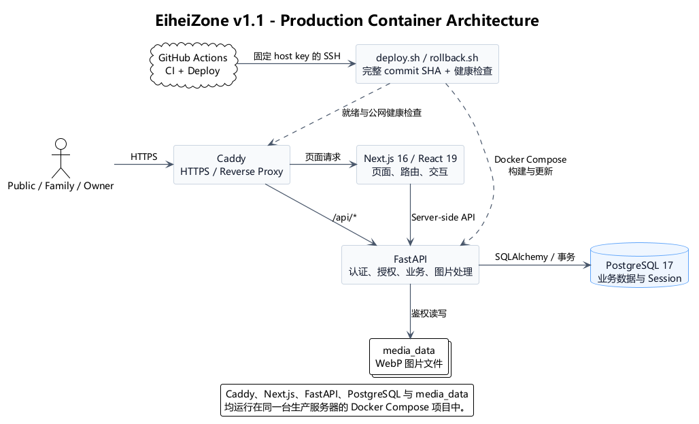

# 当前系统架构

| 适用产品版本 | Current / v1.1.x |
| --- | --- |
| 文档状态 | Active |
| 最后更新 | 2026-08-15 |

本文档记录当前架构摘要。`v1.0.0` 的完整设计保存在 [`versions/v1/02_v1_design.md`](versions/v1/02_v1_design.md)，`v1.1.0` 的增量决策保存在 [`versions/v1.1/README.md`](versions/v1.1/README.md) 及其五份迭代记录。发生冲突时，以实际代码、Migration 和当前发布记录为准。

## 1. 系统上下文

| 身份 | 主要能力 |
| --- | --- |
| Public | 阅读 `public` 近况和其中的图片。 |
| Family | 阅读家庭数据，发布文字或图文近况，提出问题。 |
| Owner | 拥有 Family 能力，并管理全部近况、回答问题和管理重大支出。 |

公开访客、Family 和 Owner 使用同一个站点 Origin。页面入口按区域区分，但真正的身份、资源可见范围和写入权限由 FastAPI 再次校验，隐藏前端入口不能替代后端授权。

## 2. 容器架构

PlantUML 源文件：[`_附件_/architecture-v1.1.puml`](_附件_/architecture-v1.1.puml)。该图采用 C4 的 Context/Container 视角，只表达角色、运行容器、持久化资源和交付入口，不展开类或函数级实现。

- Caddy 是唯一暴露 `80/443` 的服务，负责 HTTPS 和反向代理；
- Next.js 负责 App Router 页面、服务端取数、表单和浏览器交互；
- FastAPI 负责认证、授权、业务规则、事务、图片处理及全部数据库访问；
- PostgreSQL 保存用户、Session、Post、PostImage、QA 和 Expenditure；
- `media_data` named volume 保存处理后的 WebP 文件，不能脱离数据库记录单独解释其可见范围。

## 3. 代码与领域边界

后端业务模块遵循 `Router -> Service -> Repository`：Router 处理 HTTP 输入、身份依赖和 CSRF，Service 负责业务规则与事务，Repository 负责数据访问。`auth`、`posts`、`qas`、`expenditures`、`dashboard` 保持独立模块，图片处理属于 `posts` 领域。

前端使用 Next.js App Router；`src/app/` 负责路由与布局，`src/features/` 保存领域 API、类型、表单和展示逻辑，`src/components/` 保存共享 UI。Family 与 Owner 可以复用表单组件，但各自保留明确的区域路由和成功跳转目标。

## 4. v1.1 数据与接口契约

- `POST /api/v1/uploads/image` 接受 Family 或 Owner 的图片，校验并转换为 WebP，创建 `pending` PostImage；
- `POST /api/v1/posts` 接受可选 `image_ids`，按顺序绑定当前用户上传的图片；
- `GET /api/v1/media/images/{image_id}` 根据关联 Post 和当前读者鉴权，公开图片可长期缓存，家庭图片使用 `private, no-store`；
- `PostResponse` 返回 `author_id`、`author_display_name` 和 `images`，作者昵称实时取自用户资料；
- Family 与 Owner 均可创建 Post，只有 Owner 可以编辑或删除任意 Post；
- QA 响应继续返回 `answered_at`；Family 与 Owner 的提问页分别保持在各自 `/family/qas/*`、`/owner/qas/*` 路由上下文中。

`v1.1.0` 唯一新增数据库 Migration 是 `c18f6a72d901_create_post_images.py`。Post 删除时数据库记录级联删除，并由应用清理物理文件；未绑定或清理失败的图片由维护脚本按需处理。

## 5. 安全与数据边界

- Session 保存在 PostgreSQL，浏览器使用 HttpOnly、Secure、SameSite Cookie；
- 修改请求使用签名 Double Submit CSRF；
- 权限在 Router 入口检查，并在 Service 规则和 Repository 查询中再次约束；
- 数据库时间使用 UTC，界面按 `Asia/Shanghai` 展示；金额使用精确十进制，主键使用 UUID；
- 图片上传执行格式、大小、尺寸和像素检查，并重新编码以移除原始元数据；
- 开发、测试和生产数据隔离，真实环境变量、家庭数据、备份和签名材料不进入 Git。

## 6. 交付边界

Pull Request 由 GitHub Actions 执行后端、前端和部署产物检查。`main` 的 CI 成功后，Deploy workflow 通过固定 SSH host key 调用生产服务器上的 `/opt/eiheizone/deploy.sh`。部署和回滚共享文件锁，以完整 commit SHA 标记镜像，并使用 Compose 就绪状态与公网健康接口共同判定结果。

自动部署不等于数据备份。PostgreSQL 和 `media_data` 的 named volume 可以跨容器重建保留数据，但不能覆盖 VPS 丢失、磁盘损坏或误删；异机加密备份和恢复演练仍是明确的运维遗留事项。
