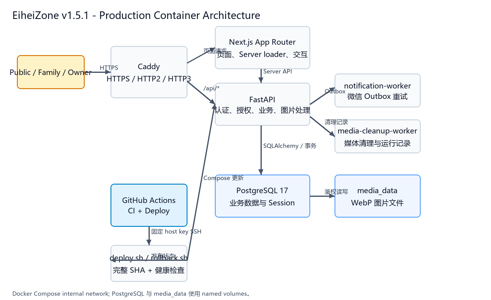

# 当前系统架构

> 当前基线：`v1.5`（最后更新：2026-11-08）

本文档是当前系统的架构摘要。历史完整设计分别保存在 `versions/v1/02_v1_design.md` 和对应版本归档中；发生冲突时，以代码、Migration、Compose 配置和已验证的发布记录为准。

## 1. 系统上下文与权限

| 身份 | 能力边界 |
| --- | --- |
| Public | 阅读公开 Post 及公开图片；不能读取家庭内容、成员空间、评论或写入数据。 |
| Family | 阅读授权家庭内容与全部家庭成员空间，维护本人成员空间（档案、相册与故事照片），发布文字/图文 Post、评论和问题，接收通知。 |
| Owner | 拥有 Family 能力，并可管理任意 Post、评论、问题回答、重大支出以及任意家庭成员的个人展示空间（支持代长辈建档与上传老照片）。 |

所有角色共用一个站点 Origin。前端路由只负责用户体验和上下文保留，真正的身份、资源可见性、CSRF 和写入权限由 FastAPI、Service 规则和数据库查询共同约束。

## 2. 生产容器架构

图表文件：`assets/architecture-v1.5.puml`（PlantUML）、`assets/architecture-v1.5.svg`（SVG 矢量）与 `assets/architecture-v1.5.png`（PNG）。图只表达角色、运行容器、持久化资源和交付入口，不展开函数级实现。

- Caddy 暴露 `80/443`（包含 UDP 443），负责 HTTPS、HTTP/2/HTTP/3 和反向代理；
- Next.js App Router 负责页面、Server loader、表单和浏览器交互；
- FastAPI 负责认证、授权、业务规则、事务、图片处理和全部数据库访问；
- `notification-worker` 轮询微信 Outbox，执行重试和失败记录；
- `media-cleanup-worker` 执行过期 pending、cleanup_pending 和孤立媒体清理（同时覆盖 `post_images` 与 `member_images`）；
- PostgreSQL 17 保存用户、Session、Post、PostImage、PostComment、MemberProfile、MemberAlbum、MemberPhoto、MemberImage、QA、Expenditure、通知和清理运行记录；
- `media_data` named volume 保存处理后的 WebP 文件，图片可见范围必须通过数据库关联和 FastAPI 鉴权解释；
- GitHub Actions 通过固定 host key 的 SSH 调用 `deploy.sh`，构建完整 commit SHA 标记镜像并检查公网健康接口。

## 3. 代码与领域边界

后端业务模块遵循 `Router -> Service -> Repository`：Router 处理 HTTP 输入、身份依赖和 CSRF；Service 负责授权、业务规则和事务；Repository 负责数据访问。

- `auth`：用户、Session、登录和 CSRF；
- `posts`：Post、图片上传/编辑、评论、媒体清理；
- `members`：家庭成员空间档案、主题与版式自定义、个人主题相册、故事照片与成员媒体鉴权；
- `qas`：家庭问题、回答和路由上下文；
- `expenditures`：Owner 管理的重大支出；
- `notifications`：微信绑定、Outbox、发送 worker 和通知设置；
- `dashboard`：登录后的聚合视图。

前端 `src/app/` 保存 App Router 页面和布局，`src/features/` 保存各领域 API、类型、Server loader、表单和展示逻辑，`src/components/` 保存跨领域 UI。Family 与 Owner 可以复用组件，但保留各自的路由上下文和成功跳转目标。

## 4. 当前数据与接口契约

- 图片上传先校验格式、大小、尺寸并重新编码为 WebP（成员空间图片额外执行 EXIF 方向矫正），再创建 `pending` 的 `PostImage` 或 `MemberImage`；删除或替换图片时由应用清理物理文件，失败项进入重试流程；
- Post 支持完整图片列表替换、顺序调整和 Owner 编辑；评论是登录用户可用的扁平文本资源，Owner 或作者可删除；
- Member Space 与活跃用户 `1:1` 对应，支持本人或 Owner 维护简要介绍、快问快答、5 套预设强调色、2 种预设版式及多主题故事相册；
- QA 和 Post 事件写入通知 Outbox，重复事件按唯一约束去重，发送失败按退避策略重试；
- 微信绑定码短期有效、一次性使用并只保存哈希；已绑定用户不能重复生成绑定码；
- 数据库当前 Migration head 为 `a7c8d9e0f1b2`，新增结构变化必须通过 Alembic Migration 和专用测试库验证。

## 5. 安全、时间和数据边界

- Session 使用 PostgreSQL 持久化，浏览器使用 HttpOnly、Secure、SameSite Cookie；
- 修改请求使用签名 Double Submit CSRF；
- 权限在 Router、Service 和 Repository 查询层重复约束，不能依赖隐藏前端入口；
- 数据库时间使用 UTC，界面按 `Asia/Shanghai` 展示；金额使用精确十进制，主键使用 UUID；
- 上传图片重新编码以移除原始元数据；生产环境变量、真实家庭数据、备份、私钥和签名材料不进入 Git；
- 慢请求阈值、请求 ID 和异常脱敏日志用于定位问题，日志不应包含凭据或完整家庭内容。

## 6. 交付、回滚与恢复

Pull Request 运行 Backend、Frontend 和 Deployment artifacts 检查。合并到 `main` 后，非纯文档变更才进入自动部署。`deploy.sh` 拒绝脏工作区和非 fast-forward 更新，使用完整 SHA 标记镜像，执行 Migration/Compose 更新并检查健康接口；失败时保存工作树、Compose、Migration 和容器日志。

`rollback.sh` 只回退到 Migration head 兼容的历史提交，不逆向执行 Alembic Migration，也不删除 named volume。COS 备份脚本和隔离恢复演练已存在，但 v1.4/006 的每日 cron 尚未安装，因此当前不能把备份描述为持续运行且有告警的服务。
