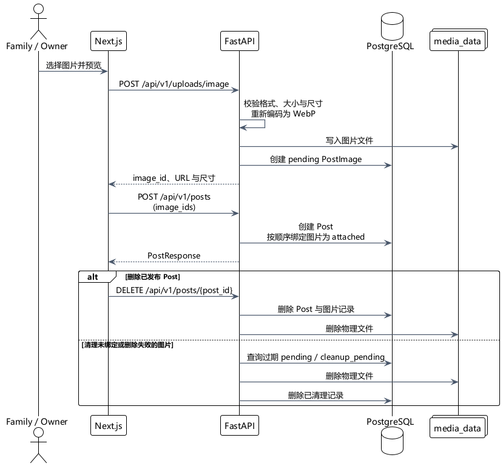

# 001：图文近况功能扩展（Post Image Support）

| 项目   | 内容                |
| ---- | ----------------- |
| 目标版本 | v1.1.0            |
| 状态   | Accepted          |
| 分支   | `feat/post-image` |
| 完成日期 | 2026-08-08        |

## 1. 需求与范围（Requirements & Scope）

近况原先只能发布文字，表达内容比较单一。本次迭代让 Owner 可以在发布近况时附带图片，并让 Family 首页、近况列表和详情页保持一致的展示体验。图片的可见范围继续跟随 Post 本身：公开近况对公开访客可见，家庭近况只对登录后的 Family / Owner 可见。

本次交付包含：

- 每条近况最多附带 9 张图片，发布前可以预览；
- 图片在列表、详情和家庭首页以网格方式展示，并支持查看大图；
- 删除近况时删除对应的图片记录和物理文件；
- 保留原有纯文字 Post 的兼容性，图片不是必填项；
- 在生产环境使用 Docker named volume 保存运行时图片。

本次明确不做图片在线裁剪、旋转、富文本混排、内容审核、图片访问审计，以及已发布图片的新增、删除和排序。这些能力需要单独迭代，不作为本次发布条件。

## 2. 核心决策矩阵（Decision Matrix）

| 编号 | 决策主题 | 优先级 | 确认结果 | 说明 |
| --- | --- | :---: | --- | --- |
| D01 | 图片存储 | P0 | Docker named volume，容器内路径 `/app/media` | 适合当前个人项目规模；文件按 `posts/YYYY/MM/UUID.webp` 组织。 |
| D02 | 上传交互 | P0 | 两阶段上传：先上传图片，再创建 Post | 前端可以先预览并显示上传状态，Post 创建接口只接收 `image_ids`。 |
| D03 | 数据模型 | P0 | 独立 `post_images` 表 | 保存图片顺序、尺寸、文件大小和生命周期状态，避免把图片数组塞进 Post 字段。 |
| D04 | 权限读取 | P0 | FastAPI 按 Post 可见范围鉴权后返回图片 | 不直接暴露磁盘目录；公开图片可缓存，Family 图片使用 `private, no-store`。 |
| D05 | 文件格式 | P0 | 后端统一输出 WebP | 前端先压缩，后端再次校验并重编码，移除 EXIF。 |
| D06 | 数量与大小 | P0 | 每帖最多 9 张；单张 5 MB；总计 30 MB | 同时限制格式、尺寸和像素数，控制存储与处理成本。 |
| D07 | 删除行为 | P1 | 删除 Post 时立即清理图片 | 数据库外键使用 `ON DELETE CASCADE`；物理文件删除失败时记录为 `cleanup_pending`。 |
| D08 | 未关联图片 | P1 | 提供手动清理脚本，不配置每日任务 | 两阶段流程可能留下超过 24 小时的 `pending` 图片；脚本不会清理已关联的 `attached` 图片。 |
| D09 | 运行时权限 | P0 | `/app/media` 由 `appuser` 拥有并可写 | 镜像预创建目录，确保新 named volume 挂载后上传不会因权限失败。 |

综合结论是：当前规模优先选择实现简单、成本低、可迁移的本地卷方案；访问控制和文件校验由后端负责，未来若数据规模或部署形态发生变化，再单独评估对象存储。

## 3. 详细设计契约（Detailed Design）

### 3.1 数据模型

新增 `post_images` 表，与 `posts` 建立一对多关系。`post_id` 允许在图片尚未发布时为空；图片发布后进入 `attached` 状态，并通过 `position` 保留展示顺序。

| 字段 | 作用 |
| --- | --- |
| `id` | UUID 主键，也是图片读取接口使用的标识。 |
| `post_id` | 关联的 Post；删除 Post 时级联删除数据库记录。 |
| `owner_id` | 上传者，用于限制图片只能由其所属 Owner 绑定。 |
| `storage_key` | 相对媒体根目录的路径，例如 `posts/2026/08/<uuid>.webp`。 |
| `width` / `height` | 处理后图片尺寸。 |
| `file_size` | 处理后 WebP 文件大小。 |
| `position` | Post 内的显示顺序，范围为 0--8。 |
| `status` | `pending`、`attached` 或 `cleanup_pending`。 |

数据库迁移为 `c18f6a72d901_create_post_images.py`。

### 3.2 接口契约

| 方法与路径 | 请求 | 返回 / 行为 |
| --- | --- | --- |
| `POST /api/v1/uploads/image` | Owner；multipart 字段 `file` | `201`，返回图片 `id`、URL、尺寸和文件信息；生成 `pending` 图片。 |
| `POST /api/v1/posts` | 原有标题、正文、可见范围，加 `image_ids` 数组 | 创建 Post，并按数组顺序绑定待发布图片。数组可为空。 |
| `GET /api/v1/media/images/{image_id}` | 图片 UUID；读者身份由 Cookie 确定 | 只有已关联且对当前读者可见的图片才返回文件，否则返回 `404`。 |
| `DELETE /api/v1/posts/{post_id}` | Owner | 删除 Post，同时清理图片记录和物理文件。 |

### 3.3 图片处理与文件路径

支持 JPEG、PNG、WebP。单张图片限制为 5 MB、最长边 4096 像素、最多 1600 万像素；单条 Post 的图片总大小不超过 30 MB。前端会先生成预览并压缩，后端仍会重新读取、校验并转换为最长边不超过 2048 像素、质量 82 的 WebP，因此前端校验不能替代后端校验。

生产环境由 Compose 将 `media_data` 挂载到 `/app/media`。Caddy 只负责 HTTPS 和反向代理，图片读取仍经过 FastAPI 的权限检查，不直接开放目录。

### 3.4 生命周期

说明：上传后未发布时，只会留下未关联的 `pending` 图片记录；超过 24 小时可手动清理。

PlantUML 源文件：[`_附件_/post-image-lifecycle.puml`](_附件_/post-image-lifecycle.puml)。导出图和源文件一同归档，后续修改流程时必须同步更新两者。

## 4. 验收与测试计划（Acceptance & Testing）

| 验收类别 | 验证内容 | 结果 |
| --- | --- | :---: |
| 后端回归 | 图片格式、大小、尺寸、Owner 权限、绑定、可见范围和删除清理 | Pass |
| API 契约 | 上传、Post 创建、图片读取和删除接口 | Pass |
| 前端回归 | 发布预览、编辑页已发布图片展示、列表/详情/家庭首页展示 | Pass |
| 自动化检查 | 后端 231 项测试、Ruff；前端 82 项测试、类型检查、生产构建 | Pass |
| 生产部署 | 迁移 `c18f6a72d901`、容器健康、HTTPS 首页、媒体卷可写性 | Pass |
| 人工业务验收 | Owner 线上完成选择图片、发布、权限访问和删除 | Accepted |

## 5. 风险与已知问题（Risks & Follow-ups）

| 风险 / 遗留事项 | 当前处理 | 后续方向 |
| --- | --- | --- |
| 已发布图片不可编辑 | 编辑页暂时只修改标题、正文和可见范围 | 后续迭代增加图片替换、删除和排序。 |
| 未关联的 `pending` 图片 | 提供 `backend/scripts/cleanup_post_images.py`，清理超过 24 小时的 `pending` 或 `cleanup_pending`；不会清理 `attached` 图片 | 当前不配置每日定时任务，按需手动执行。 |
| 单机卷的迁移与备份 | 当前只适合个人项目和单机部署 | 数据量或部署规模增长后评估对象存储和独立备份。 |
